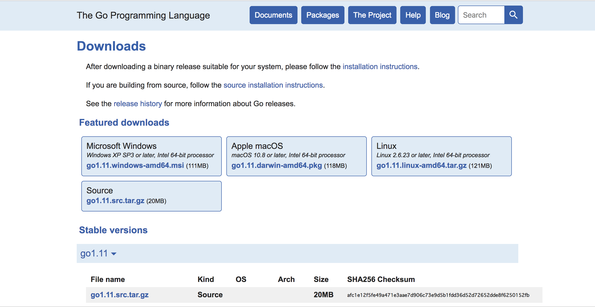

## Go言語勉強会
### 第1回 入門編
#### TD-Unit Hironori Tanoue
---
### 目次
1. はじめに
2. プログラムの構成と実行
3. 言語の基本
---
### 1. はじめに
- Go言語とは
- C言語との比較
- 開発環境
+++
### Go言語とは
- Google社によって開発 |
- コンパイル型言語 |
- マルチプラットフォーム |
- オブジェクト指向ではない |
+++
### C言語との比較
- ガベージコレクターのサポート |
- 並列処理のネイティブサポート |
- 改良されたC言語 |
+++
### 開発環境
#### Goのダウンロード
https://golang.org/dl/

+++
### 開発環境
#### インストール
- OS X 環境  
パッケージを使用して通常のインストールを実行する。
- Windows 環境  
MSIインストーラーよりインストールを実行する。
---
### 2.プログラムの構成と実行
- Hello, World!
- ああああ
- ああああ
- ああああ
+++
### Hello, World!
---?code=hello/hello.go
### おわり
